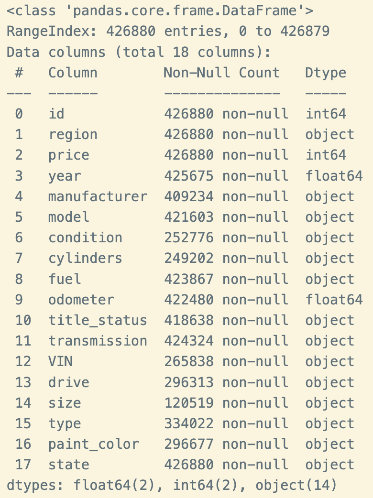
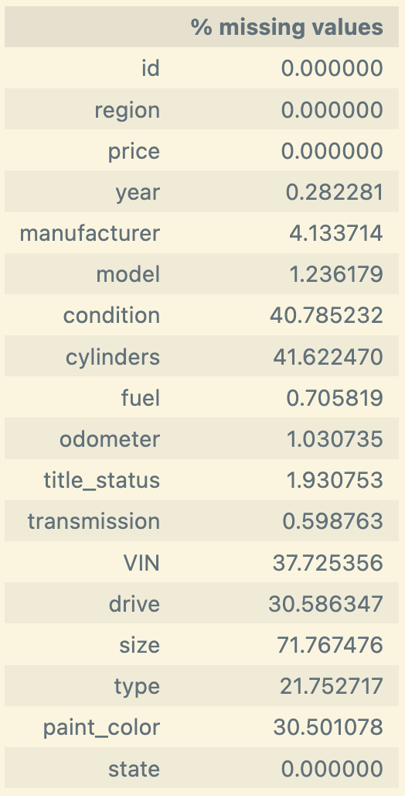
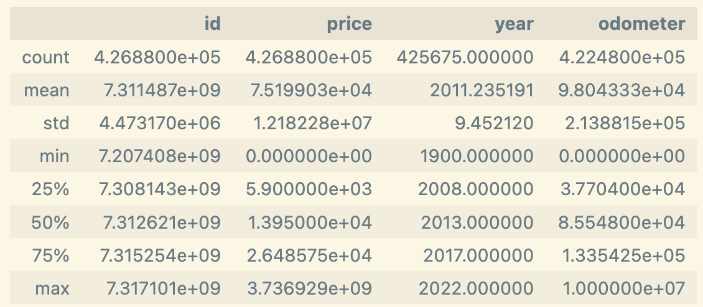
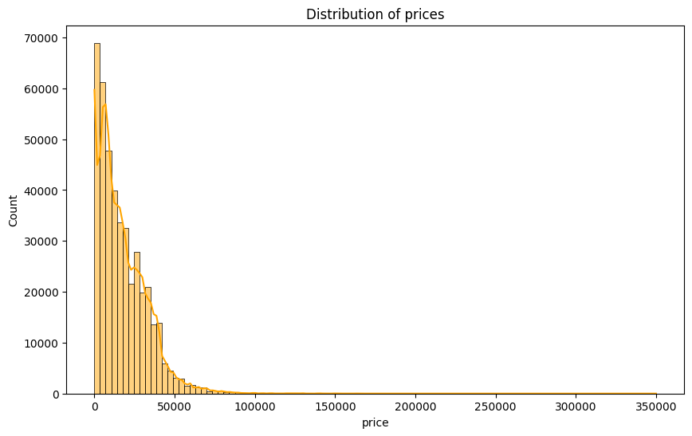
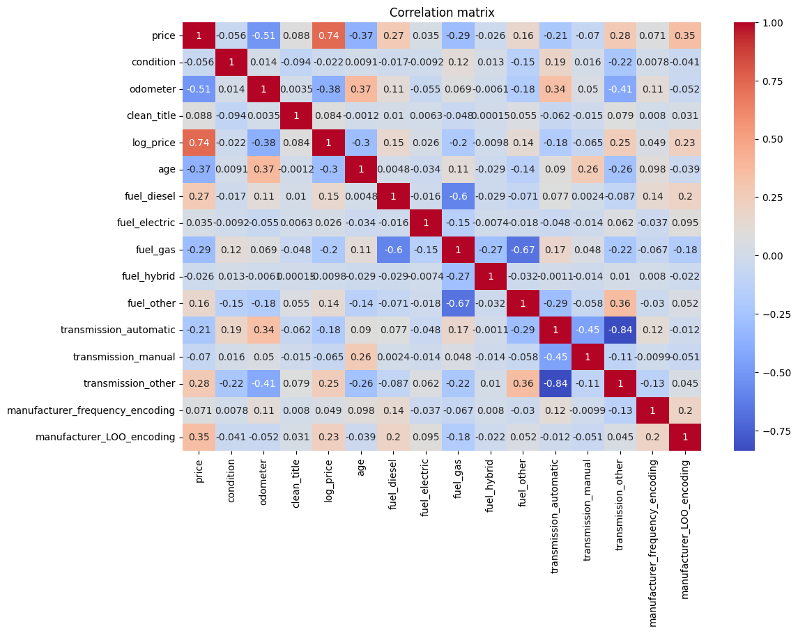

# What drives the price of a car?

## Context
 
Our goal is to understand what factors make a car more or less expensive.  Based on our analysis, we need to provide clear recommendations to the client -- a used car dealership -- as to what consumers value in a used car.

## Data

The data comes to us from [Kaggle](https://www.kaggle.com/).  The original dataset contained information on 3 million used cars.  The dataset we'll be working with contains information on 426K cars to ensure speed of processing.

# Approach

We will use the CRISP-DM framework to guide our approach.

## Business Understanding

From a business perspective, we are tasked with identifying key drivers for used car prices.  We will employ an essemble of techniques to determine feature importance and enable predictive modeling:
* Exploratory data analysis (EDA) to understand distribution of each feature and also their relationship to price
* Data preparation activities to filter out missing data, impute missing values, and engineer new features that may be useful.
* Build a model to help predict sales prices based on various features of a car

## Exploratory Data Analysis
We immediately noticed the substantial missing values and non-numerical features.

`price` and `odometer` features have very large ranges, suggesting some of the values may not be legitimate.

## Data Preparation and Feature Engineering
An extensive amount of preparation work needed to be done on the data to 
* Given the high percentage of missing values for `VIN` (>37%) and `size` (>70%), these columns were dropped.
* The features [`year`, `model`, `fuel`, `odometer`, `transmission`] all had <1.5% missing values.  The _rows_ with missing values in these were dropped.
* Imputed missing values for `manufacturer` based on text in 'model'; e.g. 'Scion' and 'Genesis'.
* Imputed missing values for `condition` feature.  'good' was used to fill in missing values
* `condition` is an ordinal categorical feature; the values were label encoded as follows:
  * 'salvage'=0
  * 'fair'=1
  * 'good'=2
  * 'excellent'=3
  * 'like new'=4
  * 'new'=5
* A new feature `clean_title` was created based on the values from `title_status`.  `clean_title` will have a value 1 if the `title_status` is 'clean', otherwise, 0 will be used as the value.
* Dropped features `model`, `state`, `region`, due to the sheer number of categorical values
* Dropped features `cylinders`, `drive`, `type`, and `paint_color` as they had over 20% missing values.  
* Dropped all rows where `price` was > $400,000.  `price` had 35 rows with non-sensical values such as 123456789, 777777, 999999, etc.
* Dropped all rows where 'price' was <= $0.  There were 28,770 rows that fit this condition.
* Odometer also had non-sensical values such as 8888888.0, 9999999.0, etc.  We capped the odometer value at 400,000 miles; 807 rows with values larger than 400K were dropped.
* Added a feature for `age` of car; dropped `year` feature
* One-hot encode `fuel` and `transmission` features
* Added feature `manufacturer_LOO_encoding` by performing Leave-One-Out target encoding of `manufacturer` feature
* Added feature `manufacturer_frequency_encoding` by performing frequency encoding of `manufacturer` feature
* Dropped `manufacturer` feature

Correlation matrix of the cleaned dataset:

Leaving aside `log_price` which has obvious and direct correlation to `price`, we can observe that both `odometer` and `age` have fairly strong negative correlation to `price`.  This logically makes sense since older and higher mileage vehicles typically are not worth as much.

## Building the Regression Models
